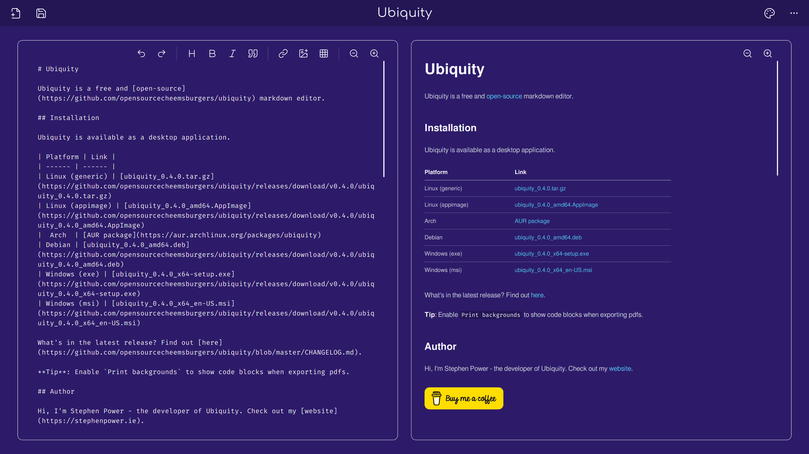

# Ubiquity

A cross-platform markdown editor.

## Why should I use it?

- ✨ Over 30 themes. ✨
- 🦋 Beautiful UI - Tailwind and DaisyUI. 🦋
- 📂 PDF Export - Printable markdown preview. 📂
- 🦀 Rusty - Built with Rust, frontend and backend. 🦀

## Ok, how do I start?

Anyone can use Ubiquity.

| Platform | Link |
| ------ | ------ |
| Web | [ubiquity.rs](https://ubiquity.rs)
| Linux (generic) | [ubiquity_0.4.0.tar.gz](https://github.com/opensourcecheemsburgers/ubiquity/releases/download/v0.4.0/ubiquity_0.4.0.tar.gz)
| Linux (appimage) | [ubiquity_0.4.0_amd64.AppImage](https://github.com/opensourcecheemsburgers/ubiquity/releases/download/v0.4.0/ubiquity_0.4.0_amd64.AppImage)
|  Arch  | [AUR package](https://aur.archlinux.org/packages/ubiquity)
| Debian | [ubiquity_0.4.0_amd64.deb](https://github.com/opensourcecheemsburgers/ubiquity/releases/download/v0.4.0/ubiquity_0.4.0_amd64.deb)
| Windows (exe) | [ubiquity_0.4.0_x64-setup.exe](https://github.com/opensourcecheemsburgers/ubiquity/releases/download/v0.4.0/ubiquity_0.4.0_x64-setup.exe) 
| Windows (msi) | [ubiquity_0.4.0_x64_en-US.msi](https://github.com/opensourcecheemsburgers/ubiquity/releases/download/v0.4.0/ubiquity_0.4.0_x64_en-US.msi)

## How is it made?

- [Yew](https://www.yew.rs) - A web application framework.
-  [Tauri](https://www.tauri.app) - A desktop application framework.
- [Tailwind](https://www.tailwindcss.com) - A CSS framework.
- [DaisyUI](https://www.daisyui.com) - A Tailwind CSS component library.

## Donations

Ubiquity is a completely free and open-source project that I have spent several months developing. 

If you enjoy using it, please consider donating to the project to support me and the future development of Ubiquity.

